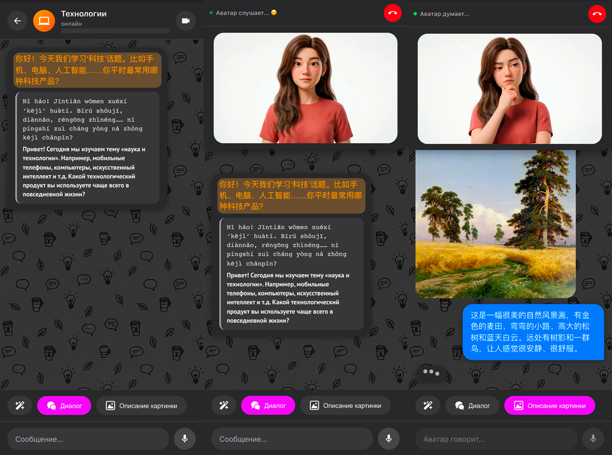
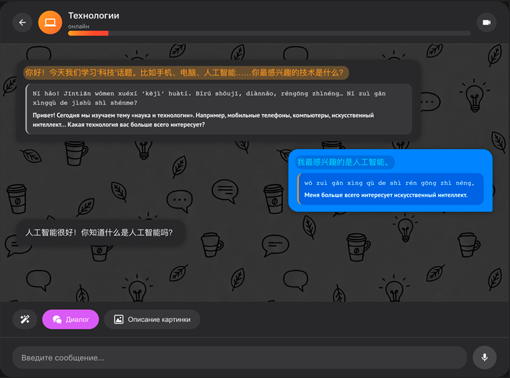
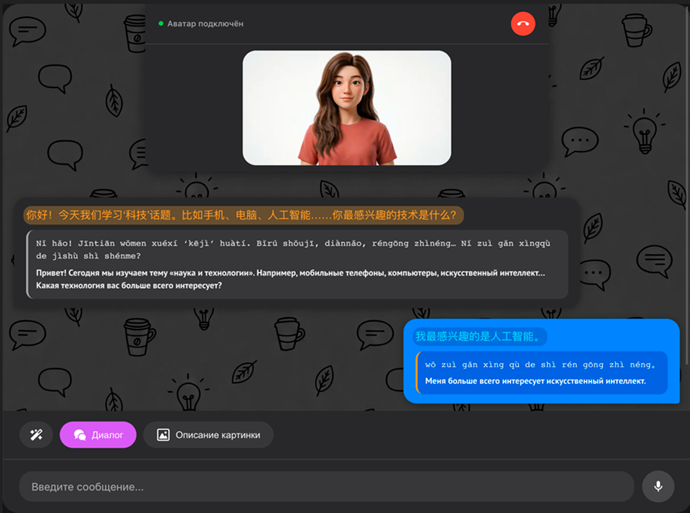
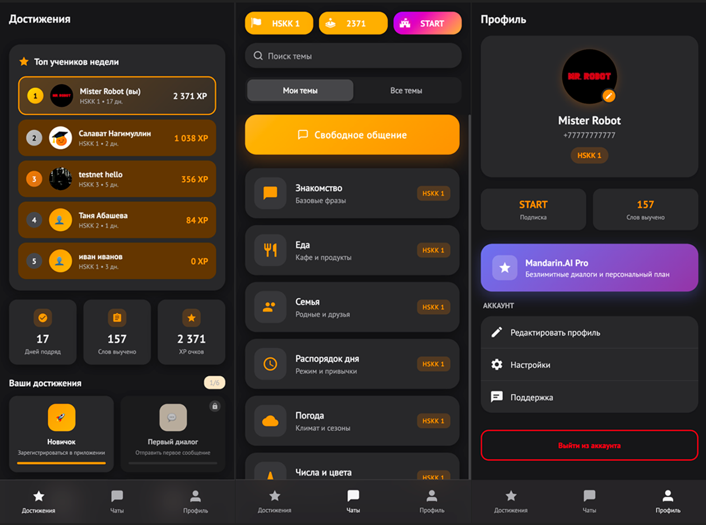
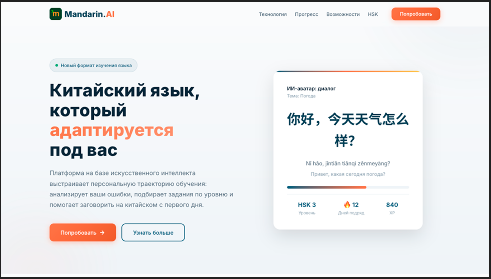
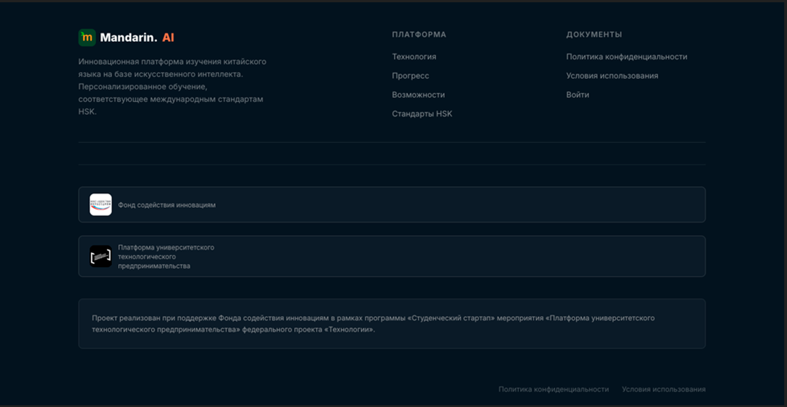
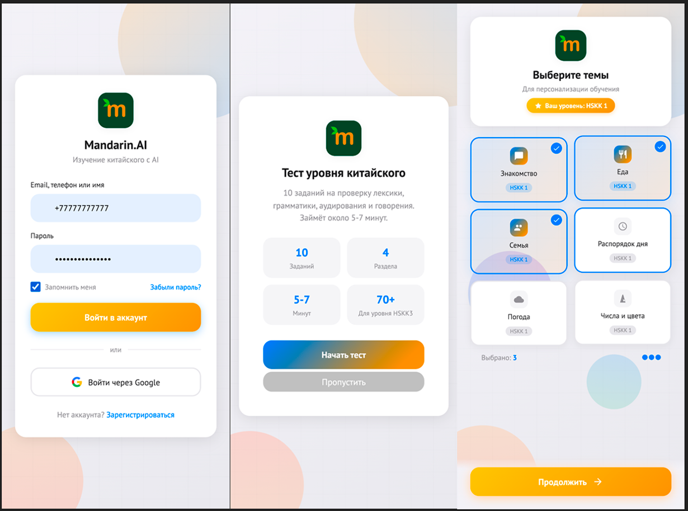

<div align="center">

# Mandarin.AI

### PWA-платформа для интерактивной практики китайского языка на базе искусственного интеллекта

[](LICENSE)
[](https://www.python.org/)
[](https://fastapi.tiangolo.com/)
[](https://web.dev/progressive-web-apps/)
[](https://nginx.org/)
[](https://mandarin-ai-learn.ru)

# [️🔗 mandarin-ai-learn.ru](https://mandarin-ai-learn.ru)

</div>

---

## 📖 О проекте

**Mandarin.AI** — это интеллектуальная образовательная платформа, автоматизирующая процесс изучения китайского языка за счёт интеграции диалоговых ИИ-моделей, систем синтеза и распознавания речи, а также обеспечивающая кроссплатформенную доступность через стандарты Progressive Web App (PWA).

Платформа заменяет базовые функции репетитора китайского языка: пользователи практикуют разговорную речь через диалоги с ИИ-аватаром, получают мгновенную обратную связь по произношению, грамматике и тонам, а также проходят персонализированную траекторию обучения на основе уровня HSK/HSKK.

> 🎯 **Миссия:** снизить барьеры в изучении китайского языка за счёт создания доступного, персонализированного и технологически автономного инструмента, способного предоставить мгновенную обратную связь по произношению и грамматике.

📄 Проект реализуется в рамках договора № 659ГССС27/107256 от 13.10.2025 г.

---

## ✨ Ключевые возможности

### 🤖 ИИ-репетитор с адаптивной сложностью
- **Диалоговые сессии** с ИИ-аватаром по 50+ тематическим модулям (от «В ресторане» до «Деловые переговоры»)
- **Мгновенная обратная связь** по грамматике, лексике и тонам с цветовой маркировкой пиньиня
- **Адаптивная сложность** — модель не генерирует конструкции выше текущего уровня HSK пользователя
- **Пошаговая коррекция** — ошибка → правильный вариант → повторение
- **Принцип минимальной подсказки** — при затруднении модель выдаёт направляющий вопрос, а не готовый ответ

### 🎤 Мультимодальное взаимодействие
- **Распознавание речи (STT)** — собственный сервер на базе Whisper/Vosk (точность 85-90%)
- **Синтез речи (TTS)** — Microsoft Edge TTS с нейросетевыми голосами (50+ языков)
- **Визуализация спектра** записи голоса в реальном времени (Canvas + Web Audio API)
- **Видеозвонки с 3D-аватаром** с эмоциональной реакцией (спокойствие, радость, грусть)
- **Режим описания картинок** — ИИ анализирует изображение и ведёт диалог по нему

### 📊 Геймификация и прогресс
- **Система XP** с начислением за качество ответов (0-15 XP за ответ, x2 во время видеозвонков)
- **Достижения и стрики** — мотивация к ежедневным занятиям
- **Лидерборд** — соревнование с другими учениками
- **Отслеживание выученных слов** с интервальным повторением
- **Входное тестирование HSKK** для определения уровня при регистрации

### 📱 PWA-функции
- **Установка на устройство** (iOS / Android / Desktop) без публикации в магазинах приложений
- **Офлайн-режим** — кэшированные уроки и локальные подсказки
- **Push-уведомления** — напоминания о занятиях и новых функциях
- **Адаптивный дизайн** — 3 breakpoints (mobile <768px / tablet / desktop >1024px)
- **Light/Dark темы** с автоматическим определением системной
- **Safe-area-inset** для устройств с вырезами

---

## 🏗️ Архитектура

### 💬 Интерфейс диалога с ИИ-аватаром
<div align="center">
  
  <p><i>Режимы диалога: без аватара, с аватаром, анализ картинки</i></p>
</div>

<div align="center">
  
  
  <p><i>Интерфейс чата с ИИ-аватаром на десктопе</i></p>
</div>

<br>

### 📱 PWA-приложение на мобильных устройствах
<div align="center">
  
  <p><i>Интерфейс PWA: достижения, чаты по HSKK, профиль</i></p>
</div>

<br>

### 🌐 Презентационный сайт стартапа
<div align="center">
  
  
  <p><i>Главная страница сайта стартап-проекта</i></p>
  
  <br>
  
  
  <p><i>Авторизация и тестирование HSKK</i></p>
</div>

---

## 🛠️ Технологический стек

### Frontend
| Технология | Назначение |
|:---|:---|
| HTML5 | Семантическая разметка, доступность (ARIA) |
| CSS3 | Custom Properties, Flexbox/Grid, анимации |
| JavaScript ES6+ Modules | Без тяжёлых фреймворков — минимальный бандл |
| Web APIs | MediaRecorder, Web Audio, Web Push, History API |
| Canvas API | Визуализация спектра голоса в реальном времени |
| Service Worker | Офлайн-режим, стратегии кэширования |

### Backend
| Технология | Назначение |
|:---|:---|
| Python 3.11+ | Язык серверной части |
| FastAPI | Асинхронный фреймворк с автогенерацией OpenAPI |
| Pydantic v2 | Строгая типизация и валидация данных |
| PostgreSQL / SQLite | Хранение пользователей, прогресса, диалогов |
| Redis | Кэширование частых запросов (снижение нагрузки на LLM на ~68%) |
| PyJWT | Аутентификация и авторизация (JWT-токены) |
| edge-tts | Синтез речи (бесплатно, 50+ языков) |
| Whisper / Vosk | Распознавание речи |
| Uvicorn | ASGI-сервер |

### Инфраструктура
| Технология | Назначение |
|:---|:---|
| Nginx 1.24 | Reverse proxy, SSL, раздача статики, rate limiting |
| Systemd | Управление микросервисами (4 сервиса) |
| Let's Encrypt | SSL-сертификаты |
| GitHub Actions | CI/CD пайплайн (сборка, линтинг, тесты, деплой) |
| Ubuntu 24.04 | Серверная ОС |

---

## 📊 Сравнение ИИ-моделей

### LLM (Large Language Models)

| Модель | Размер | Стоимость (1M токенов) | Применимость |
|:---|:---|:---|:---|
| **Qwen3-Coder-Next** ✅ | ~7B | ~$0.20-0.50 | Основная модель для диалогов |
| Qwen2.5-1.5B | 1.5B | ~$0.10-0.15 | Для переводов и простых задач |
| GPT-4o Mini | ~3B | $0.15/$0.60 | Альтернатива для премиум |
| Claude 3 Haiku | ~10B | $0.25/$1.25 | Не рекомендуется (дорого) |
| Llama 3.1 8B | 8B | ~$0.10-0.20 | Альтернатива при необходимости |

> **Выбор:** Qwen3-Coder-Next + Qwen2.5-1.5B — оптимальный баланс между качеством, скоростью и стоимостью.

### TTS (Text-to-Speech)

| Модель | Тип | Стоимость | Качество | Задержка |
|:---|:---|:---|:---|:---|
| **edge-tts** ✅ | Cloud (Microsoft) | Бесплатно | 9/10 | ~500-800ms |
| OpenAI TTS | Cloud API | $0.60/1M символов | 9.5/10 | ~300-500ms |
| Google Cloud TTS | Cloud API | $4.00/1M символов | 8.5/10 | ~400-600ms |
| Piper TTS | Локально | $0 | 7.5/10 | ~100-200ms |

> **Выбор:** edge-tts обеспечивает бесплатное качество уровня 9/10. При масштабировании (>1000 пользователей) рекомендуется переход на Piper TTS.

### STT (Speech-to-Text)

| Модель | Тип | Стоимость | Точность (китайский) | Задержка |
|:---|:---|:---|:---|:---|
| **Собственный STT** ✅ | Локально | $0 | 85-90% | ~300-500ms |
| Whisper (OpenAI) | Локально/Cloud | $0 / $0.006/мин | 95% | ~500-1000ms |
| Google Cloud Speech | Cloud API | $1.44/час | 92% | ~400-600ms |
| Vosk | Локально | $0 | 80-85% | ~200-300ms |

> **Выбор:** Собственное STT-решение на базе Whisper/Vosk обеспечивает баланс между точностью и стоимостью.

---

## 📦 Установка и запуск

### Требования
- Python 3.11+
- Nginx 1.24+
- Redis (опционально, для кэширования)
- PostgreSQL или SQLite

### 1. Клонирование репозитория

```bash
git clone https://github.com/your-username/mandarin-ai.git
cd mandarin-ai
